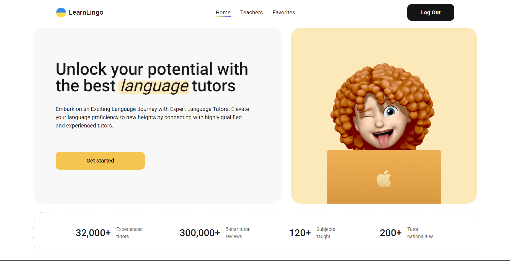

#LearnLingo
===
🌟 LearnLingo is a modern platform designed to make learning languages easier, more efficient, and personalized. This web application allows users to book trial lessons with experienced tutors, identify their current language level, and set learning goals tailored to their specific needs.

🌐 Live Website: [LearnLingo](https://learn-lingo-chi-khaki.vercel.app)

✨ Features
---
📅 Book Trial Lessons: Simple and intuitive booking process with professional tutors.
🎯 Personalized Learning: Tailored lessons to match your goals, whether for career, exams, or travel.
📱 Responsive Design: Works seamlessly on desktops, tablets, and mobile devices.
🔒 Secure and Reliable: Backed by Firebase for secure data handling and real-time updates.

| Technology | Purpose |
|-----------------------|----------------------------------------------|
| **Frontend Framework** | React |
| **Programming Language** | JavaScript |
| **Styling** | CSS Modules |
| **Backend Services** | Realtime Firebase |
| **State Management** | Redux Toolkit |
| **Form Management** | React Hook Form |
| **Form Validation** | Yup |
| **Notification** | Notistack |

💡 Getting Started
---
To explore [LearnLingo](https://learn-lingo-chi-khaki.vercel.app), visit the Live Demo.

📚 Documentation
---
📌 Learning Goals
In the booking form, users can specify their primary goal for learning languages:

- Career and Business
- Studying Abroad
- Traveling and Living Abroad
- Passing Exams
- Exploring Cultures

📌 Booking Process

1. Select your preferred tutor.
2. Choose your learning goals.
3. Fill in your name, email, and phone number.
4. Submit the form and wait for confirmation.

📞 Contact
If you have questions or suggestions, feel free to reach out:

Author: Maksym Prykhodko \
Email: m.prykhodko424@gmail.com
